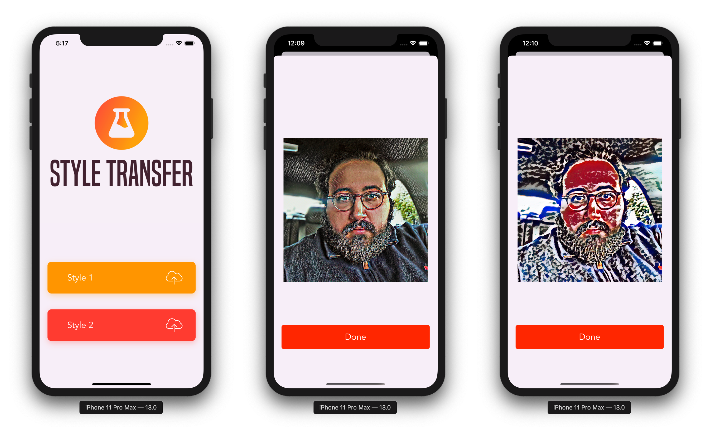

# A Simple Style Transfer iOS app
> Style Transfer Using Turicreate and CoreML

We'll create an iOS application where stylistic elements of a style image are imitated onto a new image while preserving the content of the new image.

## Final result

## Image Style Used

I have used two styles:

* **Style number 1:** it's a Moroccan Zellige which is a technique typical of Maghreb architecture that consists of assembling pieces of enamelled terracotta tiles of different colors to achieve a geometric decoration. The shards of faience are sometimes so fine that it is a true ceramic marquetry.
* **Style number 2:** That's an art piece made by a young Moroccan artist, you can check out his Instagram page
* **Input image:** well, that's me

##Colab Notebook

## About me

**Omar MHAIMDAT** 

* [Linkedin](https://www.linkedin.com/in/omarmhaimdat/)
* **Email:** omarmhaimdat@gmail.com
* [Look at the rest of my repos](https://github.com/omarmhaimdat/)

Distributed under the MIT license. See ``LICENSE`` for more information.

